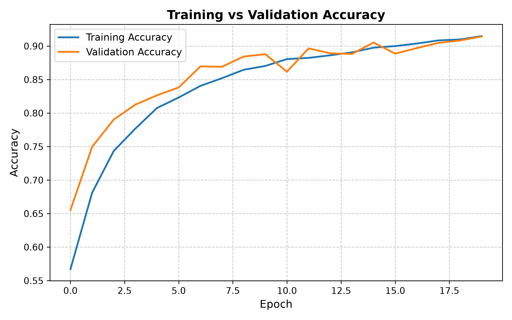
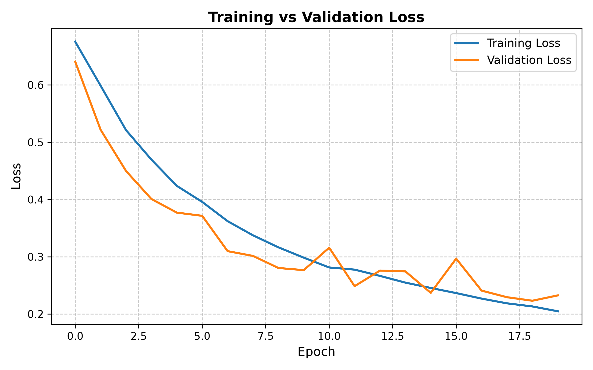
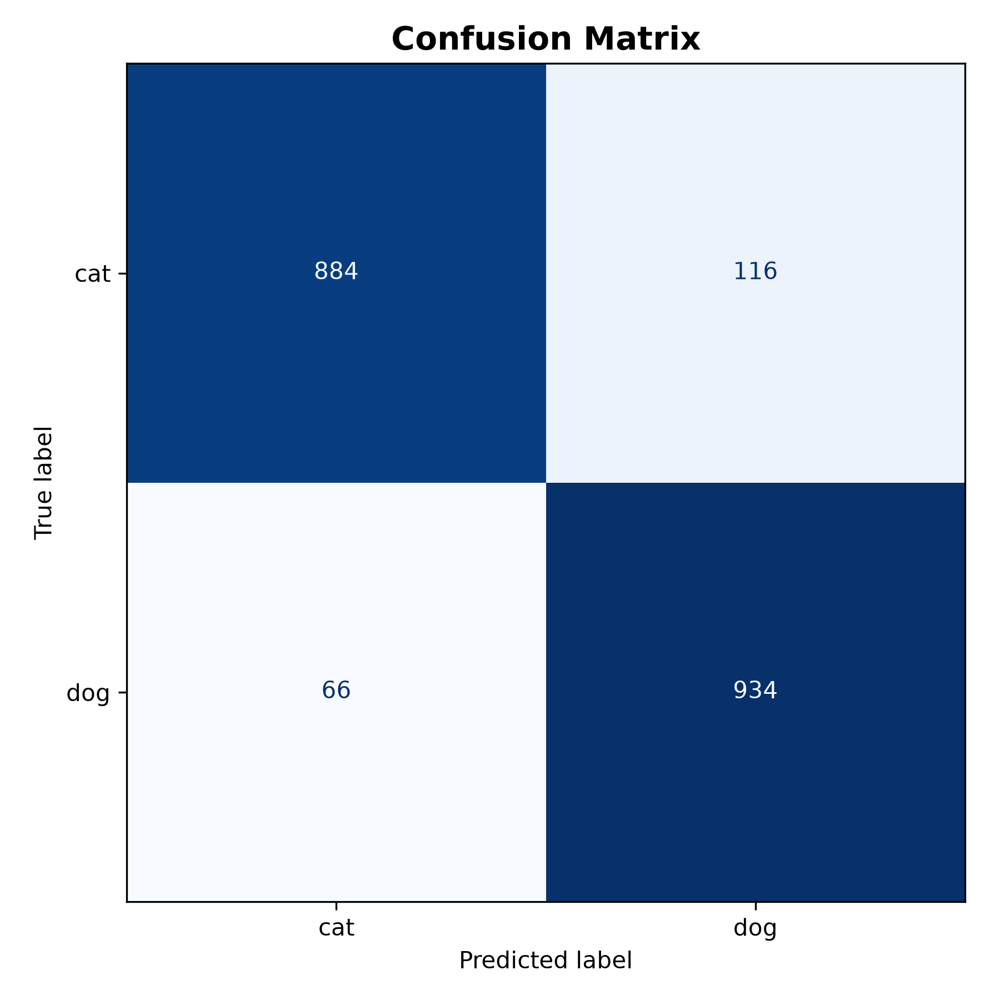

# Cat vs Dog Image Classifier (CNN)

A Convolutional Neural Network built with TensorFlow/Keras to classify images of cats and dogs, achieving **90.9% test accuracy** on a held-out set of 2,000 images.

## Dataset
- 23,000 labeled images (11,500 cats, 11,500 dogs) used for training/validation
- 2,000 held-out images used for final testing
- [Dataset source](https://lnkd.in/gJA8-5ei)

## Model Architecture
- Multi-layer Convolutional Neural Network with MaxPooling layers and Dropout regularization to prevent overfitting
- Real-time data augmentation (rotation, scaling, horizontal flips) applied via OpenCV to improve generalization
- Trained for 20 epochs

## Results

| Metric | Training | Validation |
|---|---|---|
| Accuracy | 91.5% | 91.5% |
| Loss | 0.205 | 0.230 |

**Test Set Performance (2,000 held-out images):**

| Class | Precision | Recall |
|---|---|---|
| Cat | 93.1% | 88.4% |
| Dog | 89.0% | 93.4% |

**Overall Test Accuracy: 90.9%**

### Training Curves





### Confusion Matrix



Training and validation accuracy converge closely by the final epoch with no significant overfitting, indicating good generalization to unseen data.

## How to Run

```bash
python cnn_image_classification.py
```

The trained model is saved as `cats_vs_dogs_cnn.keras` and can be loaded directly for inference:

```python
from tensorflow import keras
model = keras.models.load_model("cats_vs_dogs_cnn.keras")
```

## Tech Stack
Python, TensorFlow, Keras, OpenCV, Matplotlib, Scikit-learn

## Author
Ankit Deshmukh
